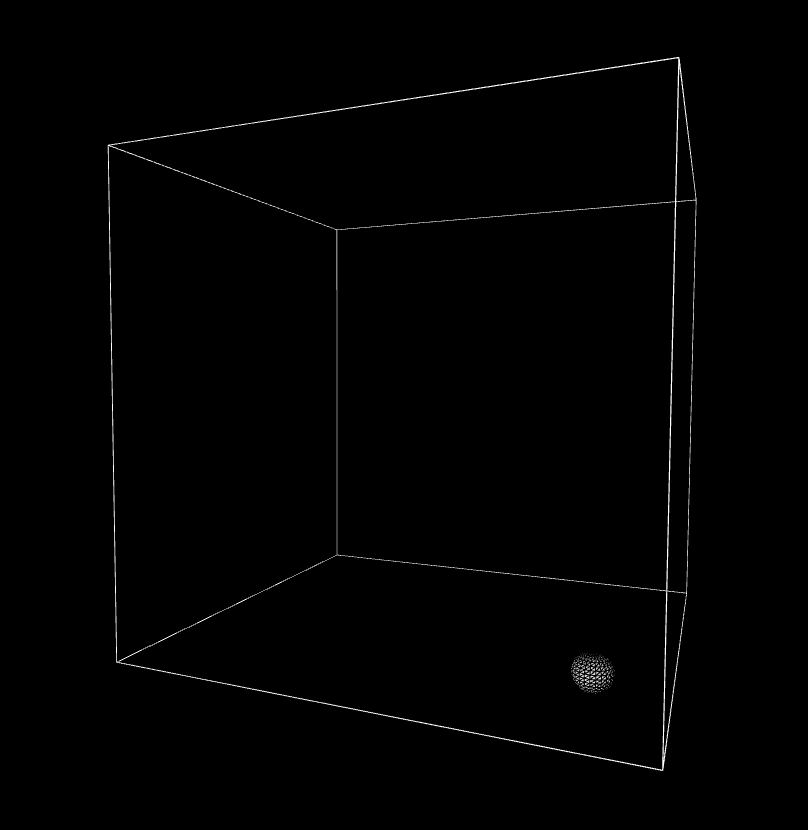

# Vector project with P5.js

## Description
Working with verctors in 3D, webgl and P5.js :clown_face:

## Features
Sphere that gets a random 3D vector and has boundries.

## Technologies Used
- P5.js
- WebGL
- HTML, CSS
- JavaScript

## Screenshots (Optional but Recommended)

## Usage
Start the page and it will work

## Credits/Attribution
- [Nature of code](https://natureofcode.com/)
- [W3school](https://www.w3schools.com/js/)
- [P5.js](https://p5js.org/reference/p5/WEBGL/)
- [Nature of code book](https://amzn.eu/d/iHky9SE)